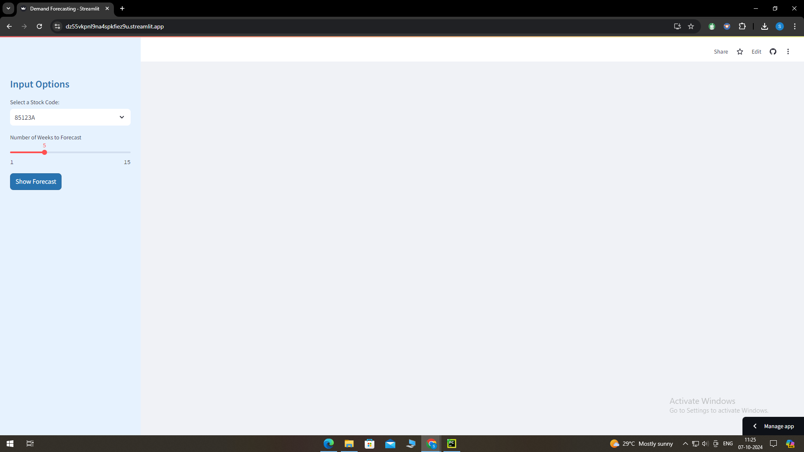
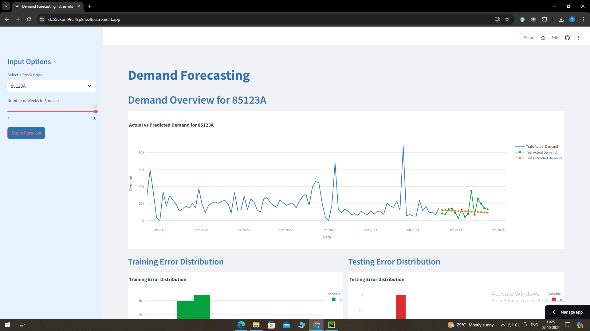
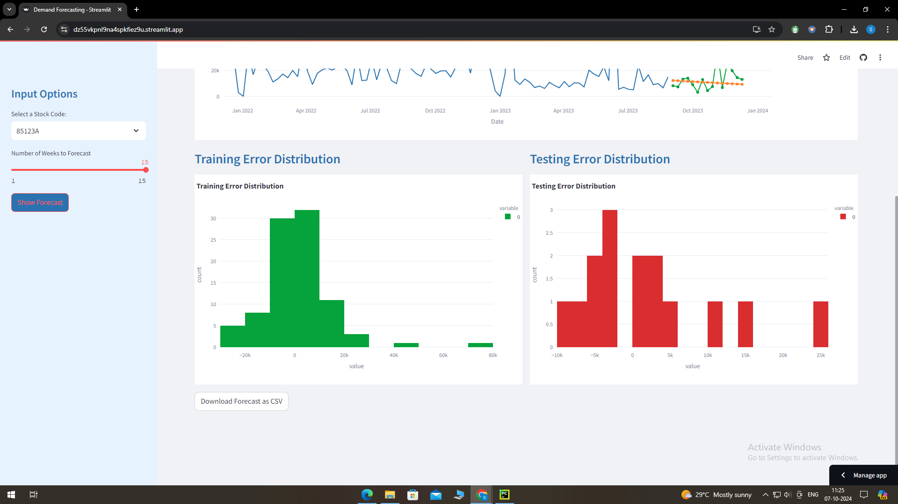

# Demand Forecasting System for Optimizing Inventory

This project implements a demand forecasting system using historical sales data from December 2021 to December 2023 to optimize inventory and supply chain efficiency. The system forecasts demand for the next 15 weeks for the top 10 best-selling products, helping the company maintain optimal stock levels and meet customer demand.

## Process Overview:
* Data Cleaning: Performed using MySQL and EXCEL.
* Code Development: Implemented time series model exponential smoothing    and machine learning models for forecasting.
* UI Refactoring: Enhanced user interface for clarity and functionality.
* Deployment: The app is deployed using Streamlit, allowing users to input stock codes and visualize demand forecasts interactively.
The app includes features like historical demand plots, forecast comparisons, and error histograms for both training and test datasets.

## APP PREVIEW

* We can download the prediction in CSV format

## Support

For support, email saihruthick28@gmail.com

## Key takeaways
* Streamlit libraries and platform: I have gained valuable knowledge about Streamlit, a powerful tool for building interactive web applications. Its user-friendly interface and efficient deployment capabilities make it a convenient choice for hosting projects.
* Exponential smoothing: Exponential smoothing has proven to be a valuable technique for forecasting future trends and outcomes. Its ability to assign weights to past data points based on their recency makes it a reliable tool for prediction tasks.
* EDA with MySQL: The EDA process becomes significantly easier with the help of MySQL. Its robust querying capabilities and ability to handle large datasets make it an invaluable tool for data exploration and analysis.

## Related

Go through the journal paper to know more about Exponential smoothing model selection for forecasting

[Journal Link](https://www.sciencedirect.com/science/article/abs/pii/S016920700500107X)

